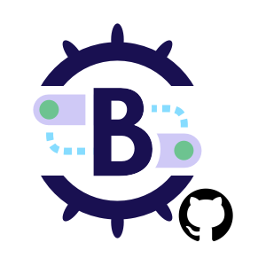

# Brigade Github Gateway


[](https://codecov.io/gh/brigadecore/brigade-github-gateway)
[](https://goreportcard.com/report/github.com/brigadecore/brigade-github-gateway)
[](https://kubernetes.slack.com/messages/C87MF1RFD)



Brigade Github Gateway receives webhooks from one or more
[GitHub Apps](https://docs.github.com/en/developers/apps/about-apps),
transforms them to Brigade
[events](https://docs.brigade.sh/topics/project-developers/events/),
and emits them into Brigade's event bus.

<br clear="left"/>

After [installation](docs/INSTALLATION.md), subscribe any number of Brigade
[projects](https://docs.brigade.sh/topics/project-developers/projects/)
to events emitted by this gateway -- all of which have a value of
`brigade.sh/github` in their `source` field.

In the example project definition below, we subscribe to all `watch:started`
events emitted by this gateway, provided they've originated from the
`example-org/example-repo` repository (see the `repo` 
[qualifier](https://docs.brigade.sh/topics/project-developers/events/#qualifiers)).
You should adjust this value to match a repository into which you have installed
your new GitHub App (see [installation instructions](docs/INSTALLATION.md)).

> ⚠️&nbsp;&nbsp;Counterintuitively, the `watch:started` event occurs when
> someone _stars_ a repository; not when they start watching it. This is a
> peculiarity of GitHub and not a peculiarity of this gateway. To learn more
> about the webhooks handled by this gateway and their corresponding events,
> check out the [event reference](docs/EVENT_REFERENCE.md).

```yaml
apiVersion: brigade.sh/v2
kind: Project
metadata:
  id: github-demo
description: A project that demonstrates integration with GitHub
spec:
  eventSubscriptions:
  - source: brigade.sh/github
    types:
    - watch:started
    qualifiers:
      repo: example-org/example-repo
  workerTemplate:
    defaultConfigFiles:
      brigade.js: |-
        const { events } = require("@brigadecore/brigadier");

        events.on("brigade.sh/github", "watch:started", () => {
          console.log("Someone starred the example-org/example-repo repository!");
        });

        events.process();
```

Assuming this file were named `project.yaml`, you can create the project like
so:

```console
$ brig project create --file project.yaml
```

Adding a star to the repo should now send a webhook from GitHub to your gateway.
The gateway, in turn, will emit an event into Brigade's event bus. Brigade
should initialize a worker (containerized event handler) for every project that
has subscribed to the event, and the worker should execute the `brigade.js`
script that was embedded in the project definition.

List the events for the `github-demo` project to confirm this:

```console
$ brig event list --project github-demo
```

Full coverage of `brig` commands is beyond the scope of this documentation, but
at this point,
[additional `brig` commands](https://docs.brigade.sh/topics/project-developers/brig/)
can be applied to monitor the event's status and view logs produced in the
course of handling the event.

## Further Reading

* [Installation](docs/INSTALLATION.md): Check this out if you're an operator who
  wants to integrate GitHub with your Brigade installation.
* [Implementing CI/CD](docs/CI_CD.md): Check this out if you're a script author
  interested in this gateway's most common use case: Enabling you do define
  and execute CI/CD pipelines in Brigade.
* [Event Reference](docs/EVENT_REFERENCE.md): Check this out if you're a script
  author or contributor who requires detailed information about all the webhooks
  handled by this gateway and the corresponding events the gateway emits into
  Brigade.

## Contributing

The Brigade project accepts contributions via GitHub pull requests. The
[Contributing](CONTRIBUTING.md) document outlines the process to help get your
contribution accepted.

## Support & Feedback

We have a Slack channel! Visit [slack.brigade.sh](https://slack.brigade.sh) to
join us. We welcome any support questions or feedback.

To report an issue or to request a feature, open an issue
[here](https://github.com/brigadecore/brigade-github-gateway/issues).

## Code of Conduct

Participation in the Brigade project is governed by the
[CNCF Code of Conduct](https://github.com/cncf/foundation/blob/master/code-of-conduct.md).
